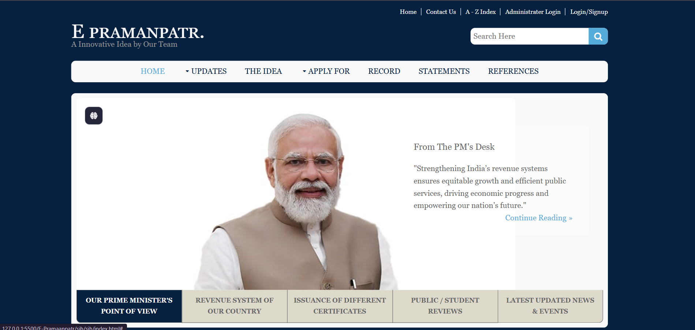

# 🪪 E-Pramaanpatr

**E-Pramaanpatr** is a digital certificate issuance and verification system aimed at bringing transparency, speed, and accessibility to the process of public document verification. This web-based portal enables individuals, institutions, and authorities to apply for, generate, and verify certificates online — all in one place.

> “A Innovative Idea by Our Team”

---

## 🖼️ Project Preview

  
*Home page preview of the E-Pramaanpatr portal*

---

## 🌐 Live Demo

🚀 [Click here to view the live website](https://yourusername.github.io/E-Pramaanpatr)

> Not hosted currently.

---

## 🧰 Tech Stack

- **Frontend**: HTML, CSS, JavaScript
- **IDE**: Visual Studio Code
- **Deployment**: GitHub Pages / Live Server
- **Version Control**: Git & GitHub

---

## ✨ Key Features

- 📜 Apply for various government/public certificates online
- 🧾 View certificate issue records
- 🧪 Verify certificates using unique IDs
- 🛂 Admin/Institution login for issuing and validating certificates
- 💬 Public/student review section
- 📰 News & announcements panel
- 🔍 Search bar for quick access

---

## 📁 Folder Structure

E-Pramaanpatr/
├── index.html
├── css/
│ └── style.css
├── js/
│ └── script.js
├── assets/
│ └── images/
│ └── screenshot.png
├── README.md
└── ...

yaml
Copy
Edit

---

## 🧪 How to Run Locally

1. Clone the repository:

```bash
git clone https://github.com/yourusername/E-Pramaanpatr.git
cd E-Pramaanpatr
Open the folder in VS Code:

bash
Copy
Edit
code .
Run using Live Server:

Install the Live Server extension in VS Code

Right-click index.html > Open with Live Server 
```

---

👤 Author
Subham Shaw
🔗 GitHub
🔗 LinkedIn

📄 License
This project is licensed under the MIT License.

🙏 Acknowledgements
Font Awesome

Google Fonts

Government & public references for content

PM's public statement (used respectfully)

🚀 Future Enhancements
🔐 OTP-based user verification

🧾 PDF certificate generation

📱 Fully responsive mobile design

🔗 Blockchain-based authentication